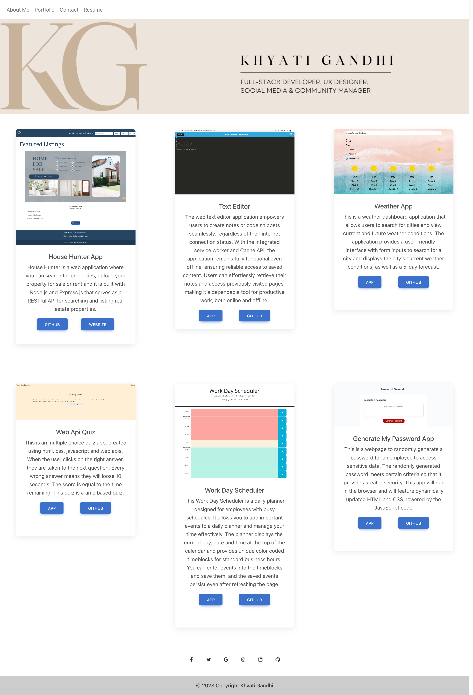
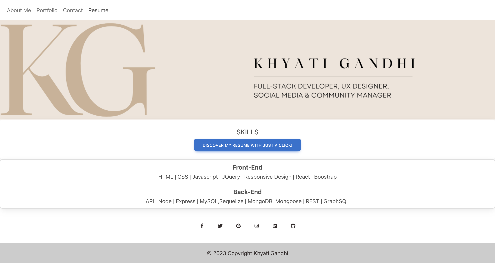

# REACT-PORTFOLIO

## Description

The web developer's single-page portfolio presents a header with navigation for sections like About Me, Portfolio, Contact, and Resume. Visitors can view the developer's short bio, explore six applications with links to deployments and GitHub repositories, and find a contact form. The footer includes links to the developer's profiles on GitHub, LinkedIn, and another platform, providing easy connections. The design ensures a seamless experience without page reloading when clicking on navigation titles.

- [Application](#Application)
- [Technologies Used](#TechnologiesUsed)
- [Installation](#Installation)
- [Usage](#usage)
- [Contributing](#Contributing)
- [License](#license)

## Application

Click here for the deployed [React App](https://thekhyatigandhi.github.io/react-portfolio/)
The following photos show how the application looks:

## Technologies Used

## Installation

In the terminal, start by typing "npm i". This will install all the dependencies and dev dependencies required. To run the app, 'npm start'.

## Usage

Through 'npm run build' the dist folder will be built, bundling your assets for efficiency. The local host server will start on local host 3000. You can also run 'npm start'. To deploy to a URL on Github pages, run 'npm run deploy' every time you have updates.

## Contributing

Contributions are welcome! If you find any issues or have suggestions for improvement, please open an issue or submit a pull request.

- Fork the repository.
- Create a new branch: `git checkout -b feature/your-feature-name`
- Make your changes and commit them: `git commit -m 'Add some feature'`
- Push to the branch: `git push origin feature/your-feature-name`
- Open a pull request.

## License

MIT License.
For more information on the license, please refer to the LICENSE file in the repo
